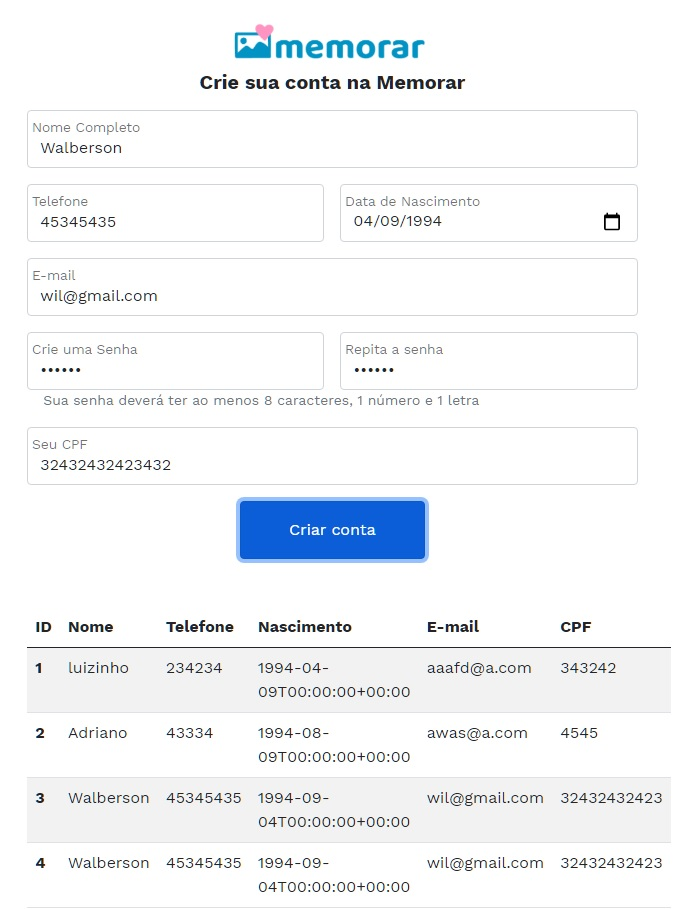

 <p align="center">
 
 <br />
  #MEMORAR REGISTRATION
  <br />
    Simple registration system with database
    <br />
    <a href="https://github.com/walberson/Memorar-Cadastro"><strong>Explore the docs »</strong></a>
    <br />
    <br />
    <a href="https://github.com/walberson/Memorar-Cadastro/issues">Report Bug</a>
    ·
    <a href="https://github.com/walberson/Memorar-Cadastro/issues">Request Feature</a>
  </p>
</p>


<!-- TABLE OF CONTENTS -->
<details open="open">
  <summary>Table of Contents</summary>
  <ol>
    <li>
      <a href="#about-the-project">About The Project</a>
      <ul>
        <li><a href="#built-with">Built With</a></li>
      </ul>
    </li>
    <li>
      <a href="#getting-started">Getting Started</a>
      <ul>
        <li><a href="#prerequisites">Prerequisites</a></li>
        <li><a href="#installation">Installation</a></li>
      </ul>
    </li>
    <li><a href="#usage">Usage</a></li>
    <li><a href="#roadmap">Roadmap</a></li>
    <li><a href="#contributing">Contributing</a></li>
    <li><a href="#license">License</a></li>
    <li><a href="#contact">Contact</a></li>
  </ol>
</details>


<!-- ABOUT THE PROJECT -->
## About The Project

[Memorar Registration]

  <p>
  
A registration system with Vue frontend and Symphony & MariaDB backend </p>


  
  
### Built With

Listed below are the frameworks and libraries used in the development of this software.
* [VueJS]
* [Symphony]
* [MariaDB]
* [Axios]
* [Bootstrap]


<!-- GETTING STARTED -->
## Getting Started

Below you will find information on how to use the software for the first time. 

### Prerequisites

<p>To run the software you need:</p>
<p>Run and download dependencies with yarn or npm</p>
<p>Copy the backend information to a Symphony container</p>
<p>Run component and VueJs with yarn serve</p>
### Installation

1. Clone the repo on
   ```sh
   git clone https://github.com/walberson/Memorar-Cadastro.git
   ```
   or download at [https://github.com/walberson/Memorar-Cadastro/archive/master.zip](https://github.com/walberson/Memorar-Cadastro/archive/main.zip)

3. Install all the packages and dependences automatically using:
      ```sh
   npm install
   ```
   or if you are using Yarn
      ```sh
   yarn install
   ```

4. Run the server VueJS
      ```sh
   yarn serve
   ```

7. Open [http://localhost:8080](http://localhost:8080) with your browser to see.

<!-- USAGE EXAMPLES -->
## Usage


_For more examples, please refer to the [Documentation](https://github.com/walberson/Memorar-Cadastro)_


<!-- ROADMAP -->
## Roadmap

See the [open issues](https://github.com/walberson/Memorar-Cadastro/issues) for a list of proposed features (and known issues).


<!-- CONTRIBUTING -->
## Contributing

Contributions are what make the open source community such an amazing place to be learn, inspire, and create. Any contributions you make are **greatly appreciated**.

1. Fork the Project
2. Create your Feature Branch (`git checkout -b feature/Memorar-Cadastro`)
3. Commit your Changes (`git commit -m 'Add some /Memorar-Cadastro'`)
4. Push to the Branch (`git push origin feature/Memorar-Cadastro`)
5. Open a Pull Request


<!-- LICENSE -->
## License

Distributed under the MIT License. See `LICENSE.TXT` for more information.


<!-- CONTACT -->
## Contact

Walberson Dias da Silva - [@walbersonmv](https://twitter.com/walbersonmv) - walberson.mv@gmail.com

Project Link: [https://github.com/walberson/Memorar-Cadastro](https://github.com/walberson/Podcastr)
